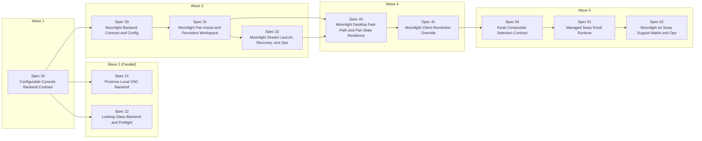

# RelayInnerDisplayScript Specs

This directory contains the current MVP spec set, the implemented console-backend expansion series, the completed Moonlight client series, the first Moonlight hardening follow-up plus the next config-surface follow-up, and the implemented Wave 5 compositor-selection plus managed sway runtime contracts for a Proxmox-hosted display relay appliance that mirrors one KVM guest directly onto a host-attached monitor.

## Spec Index

- `10-proxmox-local-console-relay-core.md`
- `11-cage-kiosk-session-shell.md`
- `12-vm-power-state-to-host-dpms-control.md`
- `13-host-power-button-to-guest-power-control.md`
- `14-proxmox-host-runtime-and-bootstrap.md`
- `15-mvp-integration-failure-policy-and-ops.md`
- `16-proxmox-host-installation-flow-and-readme-quickstart.md`
- `17-safe-uninstall-flow-and-readme-removal-guide.md`
- `20-configurable-console-backend-contract.md`
- `21-proxmox-local-vnc-backend.md`
- `22-looking-glass-backend-and-preflight.md`
- `30-moonlight-backend-contract-and-config.md`
- `31-moonlight-pair-assist-and-persistent-workspace.md`
- `32-moonlight-stream-launch-recovery-and-ops.md`
- `40-moonlight-desktop-fast-path-and-pair-state-resilience.md`
- `41-moonlight-client-resolution-override.md`
- `50-kiosk-compositor-selection-contract.md`
- `51-managed-sway-kiosk-runtime.md`
- `52-moonlight-on-sway-support-matrix-and-ops.md`

## Product Summary

RelayInnerDisplayScript turns a Proxmox host with an attached monitor into a single-purpose guest display relay:

- It boots directly into a managed kiosk session on `tty1`.
- It shows one target VM on the attached display using SPICE or loopback-only VNC with `remote-viewer` today.
- It wakes or sleeps the host monitor based on the VM power state.
- It forwards the physical host power button to guest start or shutdown behavior.
- It installs directly on the Proxmox host for the MVP rather than inside an LXC container.
- Specs 20 through 22 define the current implemented backend expansion so operators can choose SPICE, VNC, or Looking Glass from config today.
- Specs 30 through 32 define the implemented Moonlight client series for Sunshine-backed guests.
- Spec 40 captures the first Moonlight runtime hardening follow-up for `Desktop` fast-path launch and pair-state resilience.
- Spec 41 defines the next Moonlight config-surface follow-up for client resolution overrides.
- Spec 50 now implements the kiosk compositor-selection contract and runtime diagnostics.
- Spec 51 now implements the managed sway runtime path for Moonlight.
- Spec 52 remains the follow-up for the Moonlight-on-sway support matrix and operator contract.

## Shared Defaults

- Deployment target: Proxmox host direct install
- Runtime model: Python scripts plus systemd units
- Console backend: SPICE via `remote-viewer` by default
- Proxmox control path: local `qm` and `pvesh`
- Display policy: monitor on when VM is active, monitor standby when VM is off
- Power button policy: start when VM is off, graceful shutdown when VM is on

## Dependency Order

1. Spec 10
2. Spec 11
3. Spec 12 and Spec 13
4. Spec 14
5. Spec 15
6. Spec 16
7. Spec 17
8. Spec 20
9. Spec 21 and Spec 22
10. Spec 30
11. Spec 31
12. Spec 32
13. Spec 40
14. Spec 41
15. Spec 50
16. Spec 51
17. Spec 52

## Expansion Plan

Current implementation waves for the console-backend expansion:

- Wave 1: Finish Spec 20 and keep the SPICE path green on the new generic contract.
- Wave 2: Spec 21 and Spec 22 are now implemented on top of the completed Spec 20 contract.
- Wave 3: Specs 30 through 32 implement the Moonlight client path for Sunshine-backed guests.
- Wave 4: Spec 40 hardens the Moonlight runtime by decoupling paired `Desktop` launch from daemon-side app-list availability, and Spec 41 adds the next Moonlight config-surface follow-up for client resolution overrides.
- Wave 5: Specs 50 through 51 now ship the compositor-selection and managed sway runtime contracts; Spec 52 remains for the support-matrix follow-up.

Parallelization rule:

- Do not start parallel work until Spec 20 has finished the shared config model, generic `connect_console` IPC, backend-neutral session launch path, and SPICE regression coverage.
- After that point, Spec 21 owns VNC-specific daemon/config/test work while Spec 22 owns Looking Glass preflight/launch/test work.
- Do not start the Moonlight implementation series until Spec 30 has defined the backend contract, working-directory launch support, and documentation baseline.
- After that point, Spec 31 owns the persistent workspace and pair-assist flow, and Spec 32 owns runtime launch, reconnect, and operator docs.
- Do not start Spec 40 until Specs 31 and 32 have shipped the initial pair-state and app-validation contracts; Spec 40 narrows those contracts based on operational evidence.
- Do not start Spec 41 until Spec 40 has captured the current Moonlight runtime contract; Spec 41 extends only the Moonlight config and launch surface without changing the pairing or app-validation state machine.
- Do not start Wave 5 until Spec 41 has captured the intended Moonlight client-resolution contract; Spec 50 turns compositor choice into explicit configuration, Spec 51 defines the managed sway runtime, and Spec 52 updates the support matrix and operations guidance.

