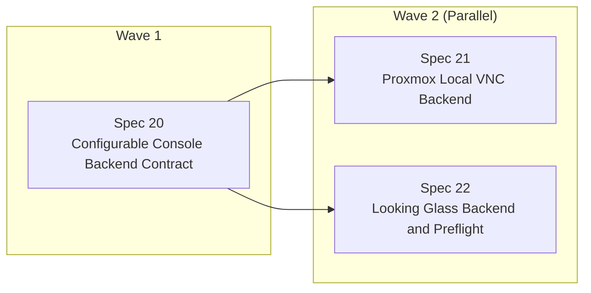

# RelayInnerDisplayScript Specs

This directory contains the current MVP spec set plus the next console-backend expansion series for a Proxmox-hosted display relay appliance that mirrors one KVM guest directly onto a host-attached monitor.

## Spec Index

- `10-proxmox-local-console-relay-core.md`
- `11-cage-kiosk-session-shell.md`
- `12-vm-power-state-to-host-dpms-control.md`
- `13-host-power-button-to-guest-power-control.md`
- `14-proxmox-host-runtime-and-bootstrap.md`
- `15-mvp-integration-failure-policy-and-ops.md`
- `16-proxmox-host-installation-flow-and-readme-quickstart.md`
- `17-safe-uninstall-flow-and-readme-removal-guide.md`
- `20-configurable-console-backend-contract.md`
- `21-proxmox-local-vnc-backend.md`
- `22-looking-glass-backend-and-preflight.md`

## Product Summary

RelayInnerDisplayScript turns a Proxmox host with an attached monitor into a single-purpose guest display relay:

- It boots directly into a Cage kiosk session.
- It shows one target VM on the attached display using SPICE or loopback-only VNC with `remote-viewer` today.
- It wakes or sleeps the host monitor based on the VM power state.
- It forwards the physical host power button to guest start or shutdown behavior.
- It installs directly on the Proxmox host for the MVP rather than inside an LXC container.
- Specs 20 through 22 define the current expansion step so operators can choose SPICE or VNC from config today, with Looking Glass planned next.

## Shared Defaults

- Deployment target: Proxmox host direct install
- Runtime model: Python scripts plus systemd units
- Console backend: SPICE via `remote-viewer` by default
- Proxmox control path: local `qm` and `pvesh`
- Display policy: monitor on when VM is active, monitor standby when VM is off
- Power button policy: start when VM is off, graceful shutdown when VM is on

## Dependency Order

1. Spec 10
2. Spec 11
3. Spec 12 and Spec 13
4. Spec 14
5. Spec 15
6. Spec 16
7. Spec 17
8. Spec 20
9. Spec 21 and Spec 22

## Expansion Plan

Current implementation waves for the console-backend expansion:

- Wave 1: Finish Spec 20 and keep the SPICE path green on the new generic contract.
- Wave 2: Spec 21 is now implemented on top of the completed Spec 20 contract; Spec 22 remains pending.

Parallelization rule:

- Do not start parallel work until Spec 20 has finished the shared config model, generic `connect_console` IPC, backend-neutral session launch path, and SPICE regression coverage.
- After that point, Spec 21 owns VNC-specific daemon/config/test work while Spec 22 owns Looking Glass preflight/launch/test work.

